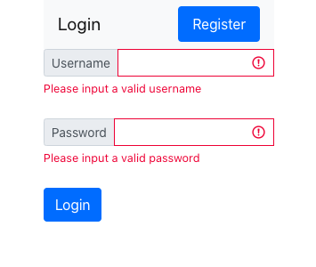
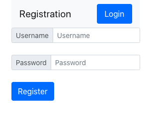
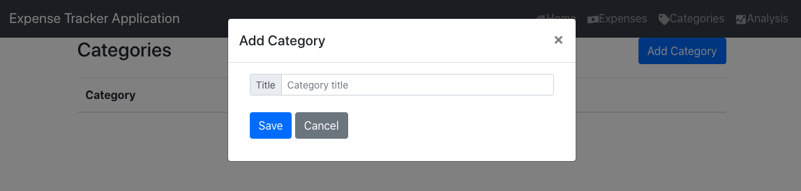
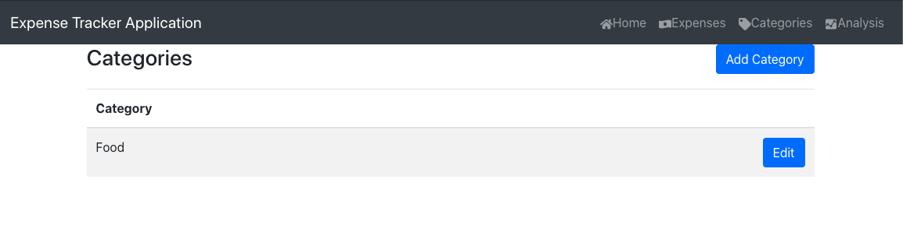
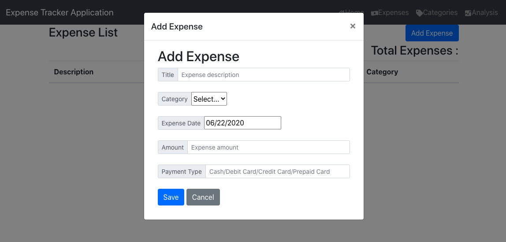
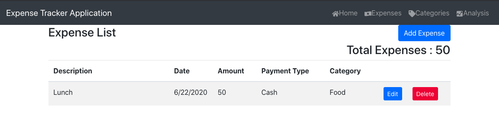
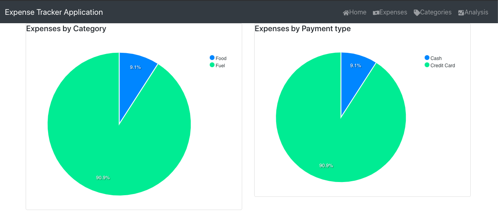

Expense Tracker application
=======

This is an expense tracker application made by using Spring-boot and React. By using this, user will be able to define their custom categories like Travel, Food, Medical etc and add expenses per category.

To start with, user must have docker installed on their system and needs to run the docker-compose.yml file present on the repo home directory. Once the docker services are up, this app can be accessed at http://localhost:3000.

On the login screen, user will be able to login if the username already exists or also register if it is the first time user.

Once logged, user will see the home screen as shown below:

Categories
-----------
Before adding expenses, user first needs to add some categories for expenses. Category can be added by clicking on categories card or from the navigation option.

Once successfully added, categories will be visible on the categories list page and also on the expense modal under categories dropdown.

User can also edit the category text and the same will reflect on the category page and also in the expense modal category dropdown.

Expenses
-----------
Once the category is added, user can then add expenses. Expenses list page can be opened by Home > Expenses or directly from the navbar option.

Click on the Add expense button to add

User needs to enter appropriate details on the modal and all are mandatory for now. Once user adds an expense, it will be visible on Expenses list page. 

User can edit an expense by clicking on edit button in the last column of grid. A similar popup like add expense will appear. User needs to edit the changes required and click on save. On deleting, an expense will be removed from database and cannot be recovered.

**By default all expenses on Expenses page appear sorted by expense date in descending order. Right now sorting is not applicable on any other column.**

**Also, expenses added for the last month are only visible and not before that**

Analysis
-----------

User can view the charts for the expenses added and analyse based on the category and payment type. Analysis page can be opened by Home>Analysis or from navigation bar option.

This is my first project using spring boot, spring security, react, mobx, react-router, reactstrap, docker. I am total newbie to all above technologies/tools and had a wonderful experience learning and using them. I have mainly followed tutorials(mentioned below), many blogs, many stackoverflow questions, websites and created it as my hobby. Right now this is in very initial stage and I will be pushing many upgrades soon.

Hope this is useful to whoever needs.

References:
Youtube tutorial videos by code engine:

https://www.youtube.com/watch?v=avvrsnYFXIE
https://www.youtube.com/watch?v=jCalDxGthoc

Web references:
stackoverflow
https://reactstrap.github.io/components/alerts/
